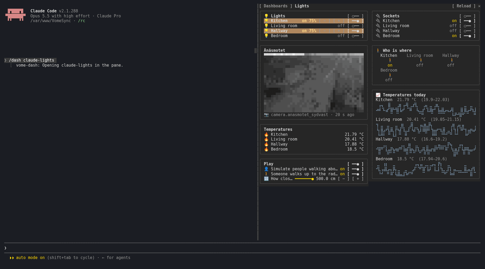
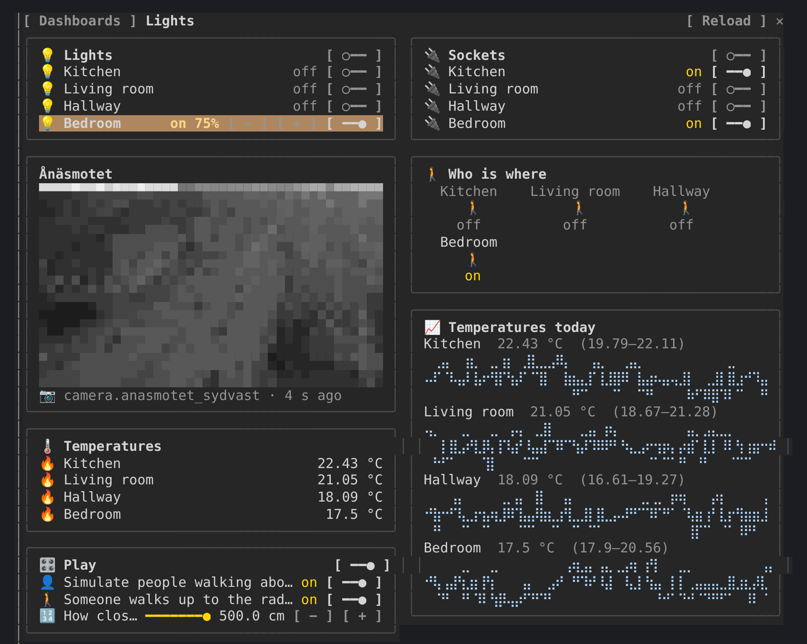

# vome-dash: your Home Assistant dashboard, working, beside Claude Code

A side pane with a Home Assistant dashboard in it: the one Claude is working
on, or any of yours. Not a picture of one: it works.



- **Live states.** Through Vome the home sends each change the moment it
  happens, so a light switched in Home Assistant changes here within a
  second, with nothing polled.
- **Controls that do what the dashboard's do.** Switches switch, lights dim
  with − and +, sliders and thermostats step, scenes and scripts run, a card's
  buttons perform their actions, asking first where the card asks first. A
  press shows its way through: sending, sent, then the new state, or "no
  change seen" if the device did not answer.
- **Drawn like Home Assistant draws it.** Cards in columns, each entity with
  its icon, a light that is on glowing in its own colour, glance cards as
  tiles, history graphs as line charts, Markdown rendered by the home,
  templates and all, and a camera's picture in coloured half blocks.
- **What Claude changes, lit up.** When Claude edits a dashboard, the cards
  it changed light up for a few seconds.

Presses are yours: Claude never presses anything in the pane.

## Quickstart

**1. Add the Vome app to Home Assistant**, then get a key from it. No sign-up needed.

[](https://my.home-assistant.io/redirect/supervisor_add_addon_repository/?repository_url=https%3A%2F%2Fgithub.com%2FVortitron%2FVomeSync)

The button opens your own Home Assistant and adds the app's repository. Pick
**Vome** and **Install**, open it, and on the **Agent** tab create a key.
Live states need the Vome app 0.3.52 or newer.

**2. Paste these into Claude Code**, in a terminal (version 2.1.275 or newer):

```
/plugin install vome-connect --marketplace Vortitron/home-assistant-mcp
```

It asks for the key from step 1. Then:

```
/plugin install vome-dash --marketplace Vortitron/home-assistant-mcp
/reload-plugins
```

Or all four Vome panes at once (automations, ESPHome, health and this one):
`/plugin install vome-panes --marketplace Vortitron/home-assistant-mcp`.



**3. Run `/dash`**, pick a dashboard, or ask Claude to build one: *"Make me a
dashboard for the lights and the temperatures"*.

## Allow its reads (auto mode)

The pane reads in the background (states, the live watch, templates,
history, camera frames), all read-only. In auto mode Claude Code refuses
background calls nobody asked for unless they are allowed by name; the pane
shows the exact lines and where they go. With `vome-connect`:

```json
"mcp__plugin_vome-connect_vome__ha_view_snapshot",
"mcp__plugin_vome-connect_vome__ha_watch_states",
"mcp__plugin_vome-connect_vome__ha_camera_frame",
"mcp__plugin_vome-connect_vome__ha_get_state",
"mcp__plugin_vome-connect_vome__ha_render_template",
"mcp__plugin_vome-connect_vome__ha_get_history",
"mcp__plugin_vome-connect_vome__ha_get_dashboard",
"mcp__plugin_vome-connect_vome__ha_list_dashboards"
```

A press calls `ha_call_service`. Allowing that by name would let Claude change
things without asking too, so the pane leaves that choice to you: use the
controls with auto mode off, or allow it if you are happy to.

## Keys

| | |
| --- | --- |
| `/dash` | open the pane and pick a dashboard (`/dash <url_path>` opens one) |
| **m** | the dashboards sidebar |
| **r** | reload the dashboard |

## Privacy and security

The pane reads through the connection Claude Code already has. A live watch
needs a key that may read the home, follows only the entities on show,
reports states and never changes anything, and its access expires within
minutes unless the key is still allowed. Camera pictures need the key's
Cameras tick.
